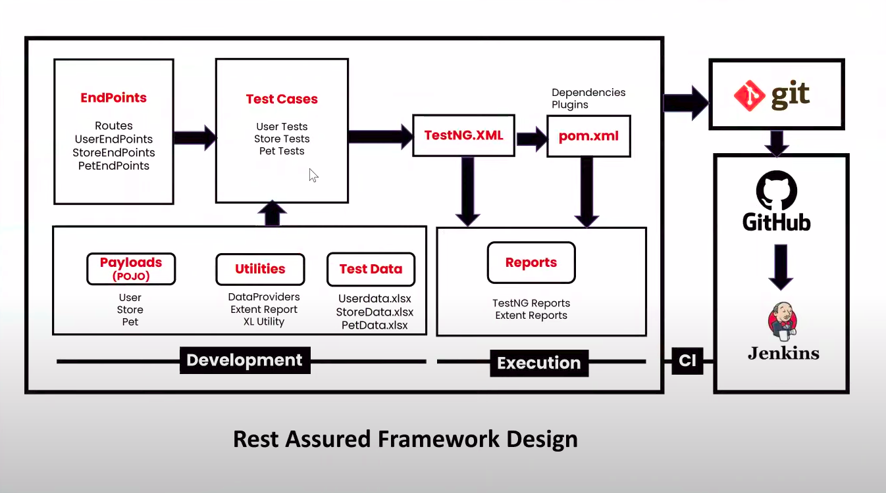

## Maven dependencies
* rest-assured
* json-path
* json
* testng
* scribejava-apis
* json-schema-validator
* gson -- map data
* javafaker
* extentreports
* poi
* poi-ooxml

## Run commands for all services tests in

```shell
mvn clean test -Dsuite-xml=src/test/resources/testng.xml
```




## Set global variable

    void testCreate(ITestContext context){
    int setVariable=given()..when()..then()..;
    
        context.setAttribute("setName",setVariable); //test level
        context.getSuite().setAttribute("setName",setVariable); //suite level
    }

## Get global variable

    void testUpdate(ITestContext context){
        int anotherVariable=(Integer) context.getAttribute("setName"); //test level
        int anotherVariable=(Integer) context.getSuite().getAttribute("setName"); //suite level
        given()..when()..then()..;
    }